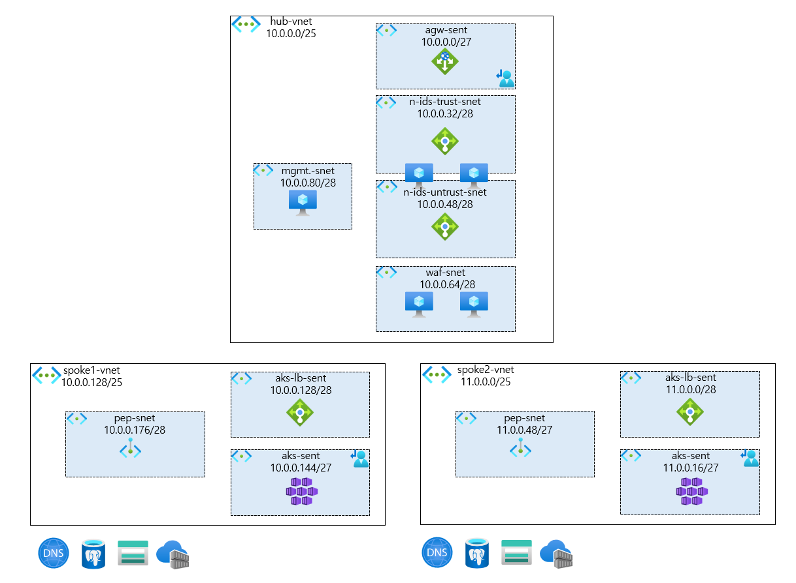

## 프로젝트 개요

이 프로젝트는 **Terraform을 사용하여 Azure 클라우드 환경에 Hub-Spoke 네트워크 아키텍처를 기반으로 다양한 서비스를 배포하고 관리**하기 위한 포트폴리오입니다.

코드형 인프라(IaC, Infrastructure as Code)의 모범 사례를 따라, Terraform의 모듈(Module) 구조를 적극적으로 활용하여 코드의 **재사용성, 가독성, 유지보수성**을 높이는 데 중점을 두었습니다.

## 주요 특징

*   **Hub-Spoke 네트워크 모델**: 중앙 허브(Hub)를 통해 모든 트래픽을 제어하고, 각 기능 단위(Spoke)를 연결하여 보안과 관리 효율성을 극대화합니다.
*   **모듈 기반 설계**: Resource Group, VNet, VM, AKS 등 각 Azure 리소스를 독립적인 모듈로 구성하여 재사용이 용이하고 관리가 편리합니다.
*   **동적 리소스 생성**: `for_each` 구문을 활용하여 `locals` 블록에 정의된 변수 목록에 따라 동적으로 리소스를 생성하고 수정할 수 있습니다.
*   **중앙 집중식 설정**: `*.tf` 파일 상단의 `locals` 블록에서 VNet, Subnet, VM 등 인프라의 전체 구성을 손쉽게 파악하고 변경할 수 있습니다.

## 아키텍처

본 프로젝트는 다음과 같은 Hub-Spoke 아키텍처를 따릅니다.

*   **Hub VNet**:
    *   Azure Firewall, Application Gateway 등과 같은 공유 서비스를 배치하는 중앙 네트워크입니다.
    *   외부 및 Spoke 간의 모든 트래픽은 이곳을 통과하며, UDR(사용자 정의 경로)을 통해 트래픽 흐름을 제어합니다.
    *   Application Gateway의 모든 트래픽은 Azure Firewall를 통과하게됩니다. 
*   **Spoke VNet**:
    *   애플리케이션(VM, AKS 등)이 실제로 배포되는 개별 네트워크입니다.
    *   각 Spoke는 Hub VNet과 피어링(Peering)으로 연결되어 통신합니다.
    *   Spoke 간의 직접 통신은 차단하고 Hub를 통하도록 강제하여 보안을 강화합니다.



## 배포 가능한 리소스

*   Resource Groups (RG)
*   Virtual Networks (VNet) & Subnets
*   VNet Peering
*   Application Gateway (AGW)
*   Azure Kubernetes Service (AKS)
*   Azure Firewall (FW)
*   Load Balancer (LB)
*   Network Security Groups (NSG)
*   Public IP Addresses (PIP)
*   Storage Accounts (STG)
*   User Defined Routes (UDR)
*   Virtual Machines (VM)

## 프로젝트 구조

```
.
├── module/             # 각 리소스별 재사용 가능한 모듈 디렉터리
│   ├── AGW/
│   ├── AKS/
│   ├── FW/
│   │   ├── fw_main.tf
│   │   ├── fw_output.tf
│   │   └── fw_variable.tf
│   ├── ... (각 리소스 폴더)
├── AGW.tf              # AGW 모듈 호출
├── AKS.tf              # AKS 모듈 호출
├── ...                 # 각 리소스별 모듈 호출 파일
├── provider.tf         # Terraform 프로바이더 설정
├── os_profile.yml      # VM 접속 정보 (비밀번호 등)
└── README.md
```

*   `module/`: 각 Azure 리소스를 생성하는 코드가 모듈화되어 있습니다. 모듈은 변수(`_variable.tf`), 실제 리소스 정의(`_main.tf`), 그리고 출력(`_output.tf`) 파일로 구성됩니다.
*   루트 `*.tf` 파일: `module/` 디렉터리의 모듈들을 호출하여 실제 인프라를 구성합니다. `locals` 블록에 정의된 값을 모듈의 변수로 전달합니다.

## 시작하기

### 사전 준비사항

1.  [Terraform](https://learn.hashicorp.com/tutorials/terraform/install-cli) 설치
2.  [Azure CLI](https://docs.microsoft.com/en-us/cli/azure/install-azure-cli) 설치
3.  Azure CLI를 통해 Azure 계정에 로그인합니다.
    ```bash
    az login
    ```

### 배포 절차

1.  **Terraform 초기화**
    Terraform 실행에 필요한 프로바이더와 모듈을 다운로드합니다.
    ```bash
    terraform init
    ```

2.  **리소스 구성 및 실행 계획 검토**
    *   루트 디렉터리의 `*.tf` 파일(예: `VNET.tf`, `VM.tf`) 내의 `locals` 블록을 열어 배포하려는 리소스의 속성(이름, 주소 공간, VM 크기 등)을 수정합니다.
    *   `os_profile.yml` 파일에 VM의 관리자 계정 정보를 안전한 값으로 수정합니다.
    *   아래 명령어를 실행하여 Terraform이 생성/수정/삭제할 리소스 목록을 확인합니다.
    ```bash
    terraform plan
    ```

3.  **인프라 배포**
    `plan`의 결과가 의도한 대로 표시되면, 아래 명령어를 실행하여 실제 Azure에 리소스를 배포합니다.
    ```bash
    terraform apply
    ```

4.  **리소스 삭제**
    프로젝트의 모든 리소스를 삭제하려면 아래 명령어를 사용합니다. (주의: 되돌릴 수 없습니다)
    ```bash
    terraform destroy
    ```